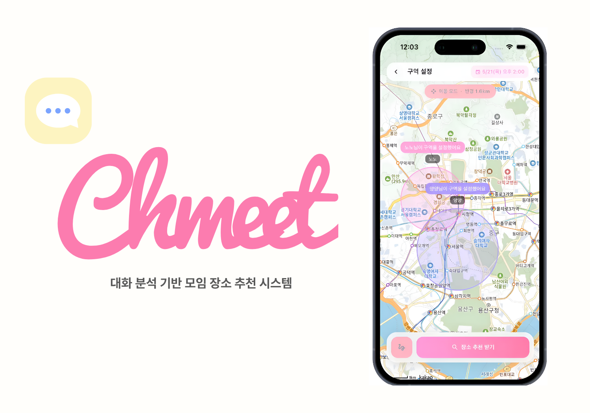
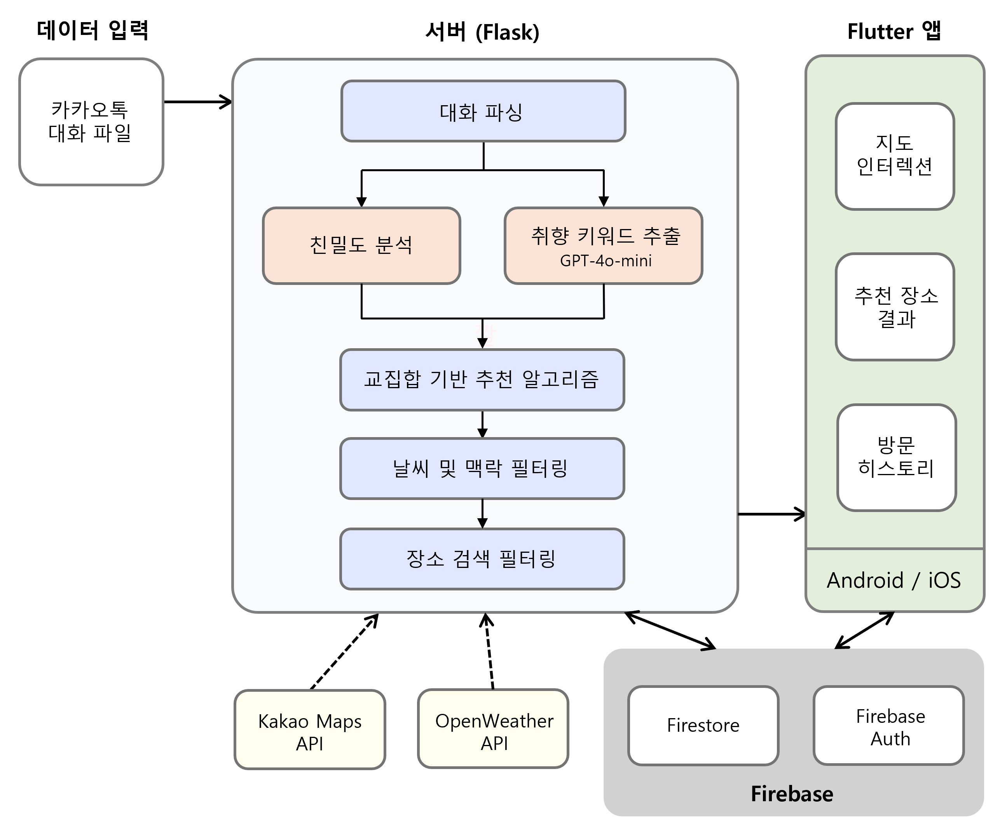

  

  
  
  
  

---

## 🎬 시연 영상

  

#### 👉 [시연영상 보러가기](https://youtu.be/QrrKvhJ12bc)

---

## ❤️ 프로젝트 개요

오늘날 약속 장소를 정할 때 위치와 취향 조율에 불필요한 시간이 소비되는 경우가 많다. 기존 서비스는 단순 중간지점 계산에 그쳐 개인 취향이나 관계의 깊이를 반영하지 못한다.

Chemeet은 카카오톡 대화 분석으로 취향과 친밀도를 파악하고, 참여자가 지도에서 설정한 이동 가능 구역의 교집합 안에서 최적 장소를 추천한다. 날씨와 친밀도를 반영해 추천 범위를 조정하고, 멤버 간 투표로 장소를 확정하면 방문 이력이 히트맵으로 축적된다.

---

## 🔑 주요 적용 기술 및 구조

### 개발 환경 및 도구

- **개발 환경**: Windows / macOS, Android, iOS, Web
- **개발 도구**: Android Studio, VS Code, Git
- **개발 언어**: Python, Dart
- **프레임워크**: Flutter 3.x, Flask
- **데이터베이스**: Firebase Firestore

### 주요 개발 기술

- 카카오톡 대화 파싱 및 취향 키워드 자동 추출
- 규칙 기반 친밀도 점수 산출
- 선호 구역 교집합 계산 및 중심 좌표 도출
- 대중교통 접근성 기반 최적 지하철역 탐색
- 교집합 영역 내 장소 검색 및 지도 시각화
- 방문 히스토리 히트맵 시각화

---

## 🛠️ 시스템 구조

  

---

## 📱 앱 화면

  

---

## 💡 핵심 성과 및 독창성

<b>자동 취향 추출 파이프라인</b>

  &nbsp;카카오톡 대화 파일 하나로 취향과 친밀도를 한 번에 파악할 수 있다. 별도 설문이나 수동 입력 없이 대화 속 선호를 자동으로 읽어낸다.

<b>교집합 기반 중간지점 알고리즘</b>

  &nbsp;단순 좌표 평균이 아닌, 각 참여자가 지도에서 이동 가능한 범위를 설정하면 구역이 겹치는 교집합 안에서 대중교통 기준 최적의 중간지점을 찾는다. 참여자 모두가 실제로 갈 수 있는 구역 안에서 중간지점을 잡는다.

<b>날씨 연동 접근성 보정</b>

  &nbsp;날씨가 좋지 않을 때 탐색 반경을 줄이고 가까운 지하철역 근처로 추천 범위를 좁힌다.

<b>관계 맥락 반영</b>

  &nbsp;친밀도에 따라 이동 반경과 장소 성격이 달라진다. 친한 친구와의 만남과 업무 미팅은 다른 추천 결과를 제공한다.

---

## 👍 기대 효과

- 대화 파일 업로드만으로 취향 분석 및 장소 추천 자동화
- 모임 장소 선정 시 발생하는 시간 낭비와 갈등 해소
- 친구·연인·직장 동료 등 다양한 관계와 상황에 폭넓게 활용 가능
- 예약 플랫폼 연동 및 확장 가능성

---

### 개발 언어

### 프레임워크 & 도구

### API

### 개발 도구

---

## 👥 팀

| 역할 | 이름 |
|---|---|
| 백엔드 · AI 모듈 | 양승연 |
| 프론트엔드 · 지도 인터랙션 | 노희서 |

  

